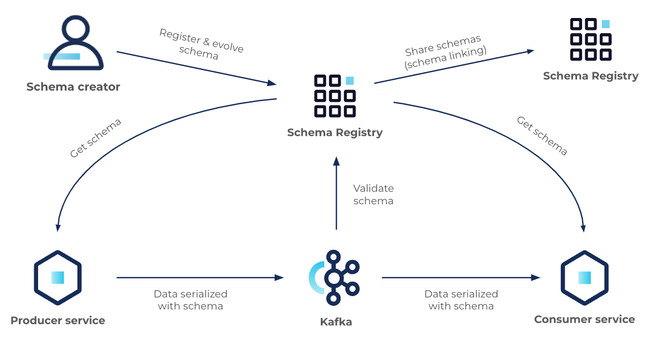

# AVRO Format
## References

- [Apache Avro Official Documentation](https://avro.apache.org/docs/)
- [Oracle getting started](https://docs.oracle.com/cd/E57769_01/html/GettingStartedGuide/avroschemas.html)
- [Confluent Schema Evolution](https://docs.confluent.io/platform/current/schema-registry/fundamentals/schema-evolution.html)

## Example Schemas
- [Example schemas by Rabo Bank](https://github.com/Axual/rabo-alerts-blog-post/tree/master/src/main/avro)
- [Example schemas  by Gwen Shapiro](https://github.com/gwenshap/kafka-examples)

## Primitive types 
- null
- int
- long
- float
- double
- bytes
- string
- boolean


## Avro Complex Types
Avro supports six kinds of complex types: 
- records
- enums
- arrays
- maps
- unions 
- fixed 

### Avro Record

May have the following attributes:
- name :  (required)
- namespace : (optional)
- doc : (optional)
- aliases : (optional) JSON array of strings, providing alternate names for this record
- fields : (required)
  - name : (required)
  - doc : (optional)
  - type  : (required) a schema, which may be a primitive/logical type or a complex schema
  - default


 ````json
 {
  "type": "record",
  "name": "LongList",
  "aliases": ["LinkedLongs"],    
  "fields" : [
    {"name": "value", "type": "long"},
    {"name": "next", "type": ["null", "LongList"]} 
  ]
}

 ````
### Avro Enums
Supports the  following attributes:
- name :  (required)
- namespace : (optional)
- doc : (optional)
- aliases : (optional) JSON array of strings, providing alternate names for this record
- symbols : (required) JSON array of strings, providing the symbols for this enum 
- default: (optional) default value for this enum

Example:
 ````json
 {
  "type": "enum",
  "name": "CustomerStatus",
  "symbols": [
    "BRONZE",
    "SILVER",
    "GOLD"
  ]
}
 ````

###  Avro Arrays
Supports a single attribute 'items' which specifies the type of the array elements.

Example:
 ````json
{
  "type": "array",
  "items" : "string",
  "default": []
}

 ````

### Avro Maps

- Supports a single attribute 'values' with the schema of the map values
- Map keys are assumed to be strings.

Example:
 ````json
{
  "type": "map",
  "values" : "long",
  "default": {}
}
 ````

### Avro Union

- Are represented using JSON arrays
- Way to define fields with muliple types
- Most common use to have optional values in a field
- Supports the  following attributes:
  - name :  (required)
  - namespace : (optional)
  - aliases : (optional) JSON array of strings, providing alternate names for this record
  - default: (optional) default value for this union, must match one of the first type

Example:

 ````json
 {
  "name" : "middle_name",
  "type": ["null", "string"],
  "default": null
}
 ````

### Fixed
Fixed uses the type name “fixed” and supports the following attributes:

- name: a string naming this fixed (required).
- namespace, a string that qualifies the name (optional);
- aliases: a JSON array of strings, providing alternate names for this enum (optional).
- size: an integer, specifying the number of bytes per value (required).

Example:

16-byte quantity may be declared with:

 ````json
 {"type": "fixed", "size": 16, "name": "md5"}

 ````

##  Logical types

- Avro has logical types to represent primitive data in a more meaningful way
- The most common logical types are:
    - decimal: (bytes) arbitrary precision and scale
    - date: (int) days since Unix epoch
    - uuid: (string) UUID
    - time-millis: (int) milliseconds since midnight
    - time-micros: (long) microseconds since midnight
    - timestamp-millis: (long)milliseconds since Unix epoch
    - timestamp-micros: (long)microseconds since Unix epoch
    - local-timestamp-millis: (long)milliseconds since Unix epoch
    - local-timestamp-micros: (long)microseconds since Unix epoch
    - duration: (fixed)number of milliseconds
  
Example:

 ````json
 {
  "name" : "middle_name",
  "type": "long",
  "logicalType": "timestamp-millis"
}
 ````

### Notes:
- Relatively new feature
- Not to be used with unions

## Use of Decimals, Floats, Doubles

The logical type decimal uses a byte array to represent the decimal value. The problem with this is that the byte array is not human readable. 

To solve this, we can use String to represent the decimal value.

Also beware of support of the specific in languages other than Java.
    


## Schema Evolution
### Evolution types
1. **Backward** : a backward compatible change. **new schema can read old data**.
2. **Forward** :  a forward compatible change. **old schema can read new data**. 
3. **Full** : when is backward and forward at the same time
4. **Breaking** : when none of those

### Backward evolution
- Delete Fields - New schema ignores unknown fields from old data
- Add optional fields  - New fields are relevant to the new schema
### Forward evolution
- Delete optional fields - Old schema 
- Add fields - Avro will ignore unknown fields
### Full evolution
- Delete optional fields (with defaults)
- Add optional fields (with defaults)

### Breaking changes
- Adding removing elements from Enum
- Changing the type of the field (i.e. string to int)
- Renaming a field

### REMEMBER
- AVRO can deserialize a record when a field is missing without error
- Backward - New Schema reads old data - delete optional, add 
- Forward  - Old Schema reads new data- delete, add optional
- Full - Both Back and For - delete optional, add optional

### Rules to avoid breaking changes
1. Make your primary key required
2. Give default values to fields that can be removed in the future
3. Be very careful when using enums
4. Don't rename fields
5. When evolving a schema **always** give default values
6. When evolving a schema **never** delete a required field

# Schema Registry

## Overview



## Data ecosystem
[From Confluence doc](https://docs.confluent.io/platform/current/schema-registry/index.html)

Schema Registry provides the following services:

- Allows producers and consumers to communicate over a well-defined data contract in the form of a schema
- Controls schema evolution with clear and explicit compatibility rules
- Optimizes the payload over the wire by passing a schema ID instead of an entire schema definition

At its core, Schema Registry has two main parts:
- A REST service for validating, storing, and retrieving Avro, JSON Schema, and Protobuf schemas
- Serializers and deserializers that plug into Apache Kafka® clients to handle schema storage and retrieval for Kafka messages across the three formats

Schema Registry seamlessly integrates with the rest of the Confluent ecosystem:
- Kafka is integrated with Schema Registry through Schema Validation on Confluent Platform and Schema Validation on Confluent Cloud.
- Connect is integrated with Schema Registry with converters.
- ksqlDB, Confluent REST Proxy, and the Confluent CLI are integrated with Schema Registry through serialization formats.
- Both the Confluent Cloud Console and Control Center for Confluent Platform are integrated with Schema Registry through the message browsers on those UIs.
Understanding schemas
A schema defines the structure of message data. It defines allowed data types, their format, and relationships. A schema acts as a blueprint for data, describing the structure of data records, the data types of individual fields, the relationships between fields, and any constraints or rules that apply to the data.

Schemas are used in various data processing systems, including databases, message brokers, and distributed event and data processing frameworks. They help ensure that data is consistent, accurate, and can be efficiently processed and analyzed by different systems and applications. Schemas facilitate data sharing and interoperability between different systems and organizations.

# CLI kafka avro

## Example producer 

-  Produce a record with one field define schema
```
kafka-avro-console-producer \
    --broker-list 127.0.0.1:9092 --topic test-avro \
    --property schema.registry.url=http://127.0.0.1:8081 \
    --property value.schema='{"type":"record","name":"myrecord","fields":[{"name":"f1","type":"string"}]}'
```
Example Data
```
{"f1": "value1"}
{"f1": "value2"}
{"f1": "value3"}
```


## Example consumer

