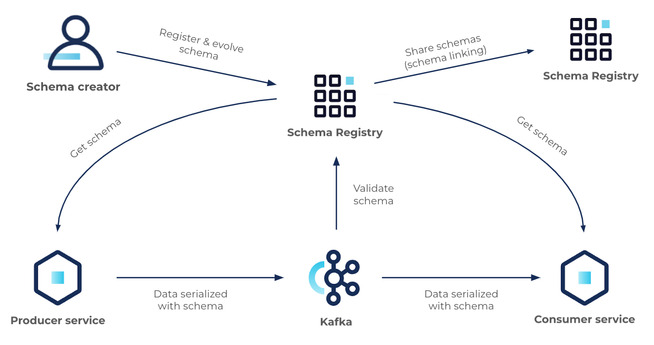

# AVRO Format

## Primitive types 
- null
- int
- long
- float
- double
- bytes
- string
- boolean

## Avro Record
- name
- namespace
- doc
- aliases
- fields
  - name
  - doc
  - type (can be primitive)
  - default 

## Avro Complex Types

You can have complex types such as:
- Enums
- Arrays
- Maps
- Unions
- Using other schemas as type
## Avro Enums

example:
 ````json
 {
  "type": "enum",
  "name": "CustomerStatus",
  "symbols": [
    "BRONZE",
    "SILVER",
    "GOLD"
  ]
}
 ````

## Avro Arrays
example:
 ````json
 {
  "type": "array",
  "items": "string"
}
 ````

## Avro Maps
example:
 ````json
 {
  "type": "map",
  "values": "string"
}
 ````


## Avro Union
Way to define fields with muliple types

Most common use to have optional values in a field

example:

 ````json
 {
  "name" : "middle_name",
  "type": ["null", "string"],
  "default": null
}
 ````

## TODO Logical types

## TODO the complex case of Decimals, Floats, Doubles

## Schema Evolution
### Evolution types
1. **Backward** : a backward compatible change. **new schema can read old data**.
2. **Forward** :  a forward compatible change. **old schema can read new data**.
3. **Full** : when is backward and forward at the same time
4. **Breaking** : when none of those

### Backward evolution
- Delete Fields
- Add optional fields 
### Forward
- Delete optional fields
- Add fields
### Full
- Delete optional fields
- Add optional fields

### Breaking changes
- Adding removing elements from Enum
- Changing the type of the field (i.e. string to int)
- Renaming a field


### REMEMBER
- AVRO can deserialize a record when a field is missing without error, that's why in 
- adding an element in an Enum

### Rules to avoid breaking changes
1. Make your primary key required
2. Give default values to fields that can be removed in the future
3. Be very careful when using enums
4. Don't rename fields
5. When evolving a schema **always** give default values
6. When evolving a schema **never** delete a required field

# Schema Registry

## Overview



## Data ecosystem
[From Confluence doc](https://docs.confluent.io/platform/current/schema-registry/index.html)

Schema Registry provides the following services:

- Allows producers and consumers to communicate over a well-defined data contract in the form of a schema
- Controls schema evolution with clear and explicit compatibility rules
- Optimizes the payload over the wire by passing a schema ID instead of an entire schema definition

At its core, Schema Registry has two main parts:
- A REST service for validating, storing, and retrieving Avro, JSON Schema, and Protobuf schemas
- Serializers and deserializers that plug into Apache Kafka® clients to handle schema storage and retrieval for Kafka messages across the three formats

Schema Registry seamlessly integrates with the rest of the Confluent ecosystem:
- Kafka is integrated with Schema Registry through Schema Validation on Confluent Platform and Schema Validation on Confluent Cloud.
- Connect is integrated with Schema Registry with converters.
- ksqlDB, Confluent REST Proxy, and the Confluent CLI are integrated with Schema Registry through serialization formats.
- Both the Confluent Cloud Console and Control Center for Confluent Platform are integrated with Schema Registry through the message browsers on those UIs.
Understanding schemas
A schema defines the structure of message data. It defines allowed data types, their format, and relationships. A schema acts as a blueprint for data, describing the structure of data records, the data types of individual fields, the relationships between fields, and any constraints or rules that apply to the data.

Schemas are used in various data processing systems, including databases, message brokers, and distributed event and data processing frameworks. They help ensure that data is consistent, accurate, and can be efficiently processed and analyzed by different systems and applications. Schemas facilitate data sharing and interoperability between different systems and organizations.